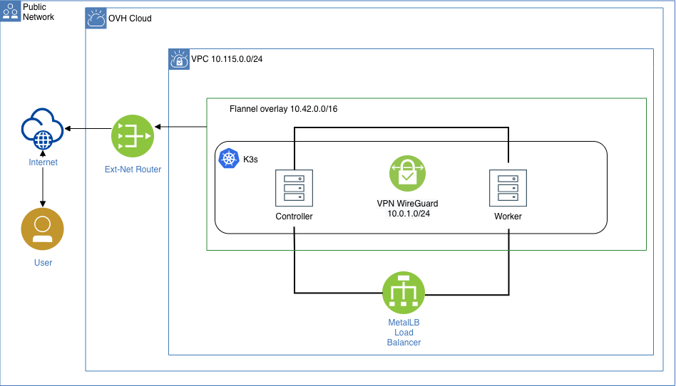

# Infrastructure Architecture

## Terraform Infrastructure Overview



A set of [terraform](https://www.terraform.io/) modules deploy a secure, functional [k3s](https://github.com/rancher/k3s) cluster on [OVH](https://www.ovhcloud.com/en/public-cloud/).

Why not Kubespray?
---

Deployment follows the [hobby-kube guidelines](https://github.com/hobby-kube/guide) for setting up a secure Kubernetes cluster.

Following cloud-native projects are installed as a part of deployment:

* [traefik](https://github.com/containous/traefik)
* [cert-manger](https://github.com/jetstack/cert-manager)
* [metallb](https://github.com/metallb/metallb)  
* [argocd](https://github.com/argoproj/argo-cd)  

Dependencies
---
The following is required to be installed on your system:

* terraform
* wireguard
* jq
* kubectl

Deployment
---
Clone the repository:
```sh
$ git clone git@github.com:netguru-interview/terraform-k3s.git
```

Copy [example.tfvars](https://github.com/netguru-interview/terraform-k3s/blob/master/example.tfvars) to terraform.tfvars

```sh
$ cp example.tfvars terraform.tfvars
```

Using your favourite editor, update values in terraform.tfvars marked required:
```sh
$ vim terraform.tfvars

# DNS Settings
create_zone           = "true"
domain                = "kloud-native.com"
digitalocean_token    = <required>
```

Run `terraform init` to initalize modules:
```sh
$ terraform init
```

Run `terraform plan` to view changes terraform will make:
```sh
$ terraform apply
```

Run `terraform apply` to create your resources:
```sh
$ terraform apply --auto-approve
```

Set `KUBECONFIG`:
```sh
eval $(terraform output kubeconfig)
```

Check resources `kubectl get po -A -o wide`
```sh
NAMESPACE        NAME                                                        READY   STATUS    RESTARTS   AGE
kube-system      pod/kube-flannel-ds-amd64-w6qx9                             1/1     Running   0          16h
kube-system      pod/metrics-server-7566d596c8-xj86w                         1/1     Running   0          16h
kube-system      pod/coredns-7944c66d8d-qnvcj                                1/1     Running   0          16h
kube-system      pod/local-path-provisioner-6d59f47c7-s4pl6                  1/1     Running   0          16h
kube-system      pod/kube-flannel-ds-amd64-n6vks                             1/1     Running   0          16h
cert-manager     pod/cert-manager-cainjector-678b44fb8c-9mf9h                1/1     Running   0          16h
cert-manager     pod/cert-manager-65b665b74d-8bjkg                           1/1     Running   0          16h
cert-manager     pod/cert-manager-webhook-57d5ffc9cb-j8cbx                   1/1     Running   0          16h
default          pod/traefik-cb68d6bf5-nlhzr                                 1/1     Running   0          16h
argocd           pod/latest-argocd-redis-654b77c6cd-g6ffw                    1/1     Running   0          16h
metallb-system   pod/controller-7694dcd576-kbqbq                             1/1     Running   0          16h
metallb-system   pod/speaker-gjbpz                                           1/1     Running   0          16h
metallb-system   pod/speaker-gf7tv                                           1/1     Running   0          16h
argocd           pod/latest-argocd-application-controller-5b99488c78-hxpsq   1/1     Running   0          16h
argocd           pod/latest-argocd-dex-server-9c65dfd7-brvvt                 1/1     Running   3          16h
argocd           pod/latest-argocd-server-575d57c745-gv5w9                   1/1     Running   0          16h
argocd           pod/latest-argocd-repo-server-54d5499fc6-8wrvs              1/1     Running   0          16h

NAMESPACE      NAME                                           TYPE           CLUSTER-IP      EXTERNAL-IP    PORT(S)                      AGE
default        service/kubernetes                             ClusterIP      10.43.0.1       <none>         443/TCP                      16h
kube-system    service/kube-dns                               ClusterIP      10.43.0.10      <none>         53/UDP,53/TCP,9153/TCP       16h
kube-system    service/metrics-server                         ClusterIP      10.43.247.198   <none>         443/TCP                      16h
cert-manager   service/cert-manager                           ClusterIP      10.43.236.173   <none>         9402/TCP                     16h
cert-manager   service/cert-manager-webhook                   ClusterIP      10.43.208.42    <none>         443/TCP                      16h
argocd         service/latest-argocd-redis                    ClusterIP      10.43.45.175    <none>         6379/TCP                     16h
argocd         service/latest-argocd-dex-server               ClusterIP      10.43.2.73      <none>         5556/TCP,5557/TCP            16h
argocd         service/latest-argocd-server                   ClusterIP      10.43.230.232   <none>         80/TCP,443/TCP               16h
argocd         service/latest-argocd-repo-server              ClusterIP      10.43.197.228   <none>         8081/TCP                     16h
argocd         service/latest-argocd-application-controller   ClusterIP      10.43.161.54    <none>         8082/TCP                     16h
default        service/traefik                                LoadBalancer   10.43.66.104    <redacted>     80:31722/TCP,443:30011/TCP   16h

NAMESPACE        NAME                                   DESIRED   CURRENT   READY   UP-TO-DATE   AVAILABLE   NODE SELECTOR                 AGE
kube-system      daemonset.apps/kube-flannel-ds-amd64   2         2         2       2            2           <none>                        16h
metallb-system   daemonset.apps/speaker                 2         2         2       2            2           beta.kubernetes.io/os=linux   16h

NAMESPACE        NAME                                                   READY   UP-TO-DATE   AVAILABLE   AGE
kube-system      deployment.apps/metrics-server                         1/1     1            1           16h
kube-system      deployment.apps/coredns                                1/1     1            1           16h
kube-system      deployment.apps/local-path-provisioner                 1/1     1            1           16h
cert-manager     deployment.apps/cert-manager-cainjector                1/1     1            1           16h
cert-manager     deployment.apps/cert-manager                           1/1     1            1           16h
cert-manager     deployment.apps/cert-manager-webhook                   1/1     1            1           16h
default          deployment.apps/traefik                                1/1     1            1           16h
argocd           deployment.apps/latest-argocd-redis                    1/1     1            1           16h
metallb-system   deployment.apps/controller                             1/1     1            1           16h
argocd           deployment.apps/latest-argocd-application-controller   1/1     1            1           16h
argocd           deployment.apps/latest-argocd-dex-server               1/1     1            1           16h
argocd           deployment.apps/latest-argocd-server                   1/1     1            1           16h
argocd           deployment.apps/latest-argocd-repo-server              1/1     1            1           16h

NAMESPACE        NAME                                                              DESIRED   CURRENT   READY   AGE
kube-system      replicaset.apps/metrics-server-7566d596c8                         1         1         1       16h
kube-system      replicaset.apps/coredns-7944c66d8d                                1         1         1       16h
kube-system      replicaset.apps/local-path-provisioner-6d59f47c7                  1         1         1       16h
cert-manager     replicaset.apps/cert-manager-cainjector-678b44fb8c                1         1         1       16h
cert-manager     replicaset.apps/cert-manager-65b665b74d                           1         1         1       16h
cert-manager     replicaset.apps/cert-manager-webhook-57d5ffc9cb                   1         1         1       16h
default          replicaset.apps/traefik-cb68d6bf5                                 1         1         1       16h
argocd           replicaset.apps/latest-argocd-redis-654b77c6cd                    1         1         1       16h
metallb-system   replicaset.apps/controller-7694dcd576                             1         1         1       16h
argocd           replicaset.apps/latest-argocd-application-controller-5b99488c78   1         1         1       16h
argocd           replicaset.apps/latest-argocd-dex-server-9c65dfd7                 1         1         1       16h
argocd           replicaset.apps/latest-argocd-server-575d57c745                   1         1         1       16h
argocd           replicaset.apps/latest-argocd-repo-server-54d5499fc6              1         1         1       16h
```

SSH to master with `eval $(terraform output ssh-master)`:
```sh
eval $(terraform output ssh-master)
```
