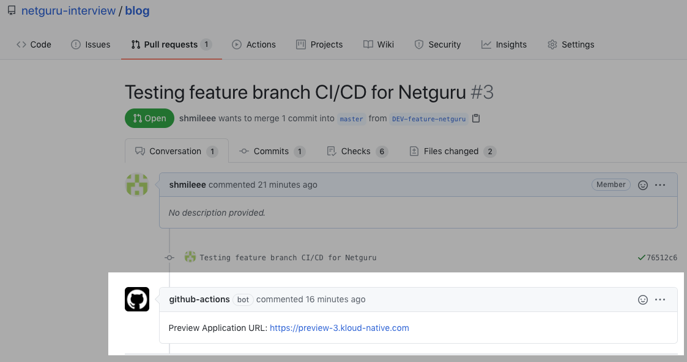
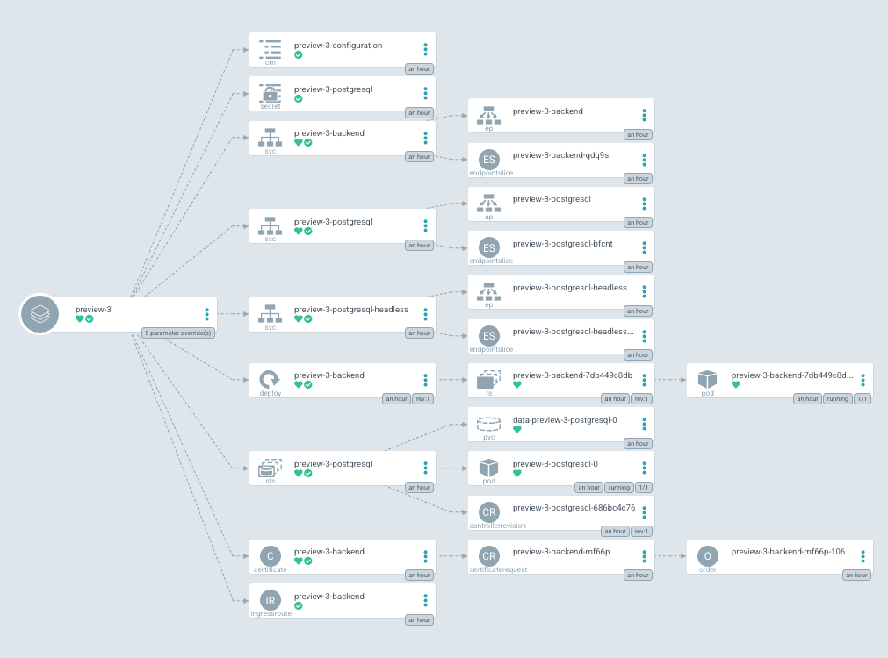

# Preview Environment Example

## Generating a preview environment

When the developer makes the change to their branch, with the ultimate
goal of merging those branch changes into the `master` branch for
deployment to production, they save their changes from within their
integrated development environment (IDE) and commit it to the source
repository, such as GitHub. The process to generate a preview
environment is typically like committing code in a traditional
development environment:

A developer makes a branch to their local cloned source repository to create a new feature:

```sh
$ git clone git@github.com:netguru-interview/blog.git
$ cd blog
```

```sh
$ git checkout -b DEV-feature1
```

The developer makes changes to the source code in their branch and adds the affected files to the commit queue:

```sh
$ git add backend/flaskblog/models.py
```

The developer commits the files adding a comment about what has changed:

```sh
$ git commit -m "added user model"
```

The developer runs `git push` to send the code back to the remote  repository and create a pull request:

```sh
$ git push origin DEV-feature1
```
Git CLI displays a link to create a pull request. The developer can highlight the URL, right-click and choose *Open URL* to see the GitHub page in their browser.

GitHub Workflow creates a preview environment in the PR for the application changes and displays a link to evaluate the new feature:


The preview environment is created whenever a pull request to master is created in the
repository, allowing any relevant user to validate or evaluate features,
bugfixes, or security hotfix. Then, as additional commits are added to the PR branch
the preview environment is automatically updated.

## What happens when a Preview Environment is created

* a new [ArgoCD Application](https://argoproj.github.io/argo-cd/core_concepts) of kind `App` is created in a `ci` [kubernetes namespace](https://kubernetes.io/docs/concepts/overview/working-with-objects/namespaces/) which shows up in the [argocd app list](https://argoproj.github.io/argo-cd/getting_started/#creating-apps-via-cli) command so you can see which preview environments are active and switch into them to look around:

```sh
$ argocd app list  
NAME       CLUSTER                         NAMESPACE  PROJECT  STATUS  HEALTH   SYNCPOLICY  CONDITIONS  REPO                                                       PATH  TARGET
preview-3  https://kubernetes.default.svc  ci         default  Synced  Healthy  Auto        <none>      https://github.com/netguru-interview/blog-helm-charts.git  .
```

* the Pull Request is built as a preview Docker image and deployed into the preview environment via [GitHub Workflow](https://github.com/netguru-interview/blog/blob/master/.github/workflows/ci.yaml)
* a comment is added to the Pull Request to let your team know the preview application is ready for testing with a link to open the application. So in one click your team members can try out the preview.

### Example ArgoCD Preview Environment
[](assets/argocd-example.png)

## What happens when a Pull Request is closed

* Once Pull Request is merged or closed (declined) - preview environment is automatically deleted
and all underlying resources are released. For this to happen, [pr-closed workflow](https://github.com/netguru-interview/blog/blob/master/.github/workflows/pr-closed.yaml) is being executed when a specific event happens. For more information, refer to [github workflow documentation](https://docs.github.com/en/actions/reference/events-that-trigger-workflows),
* a comment is added to the Pull Request to let your team know the preview environment is deleted.
